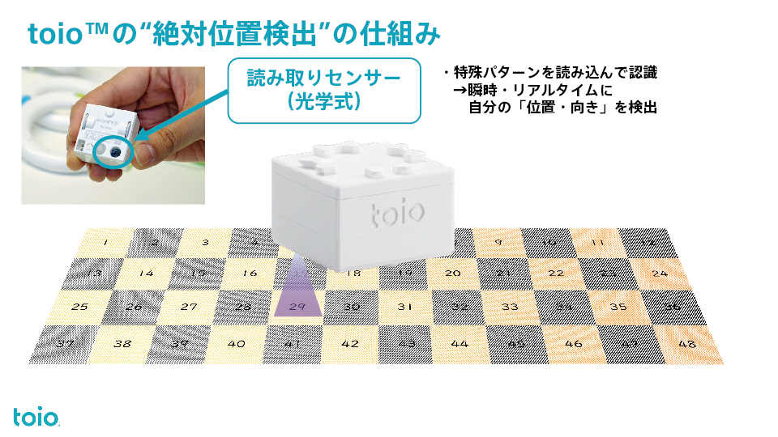
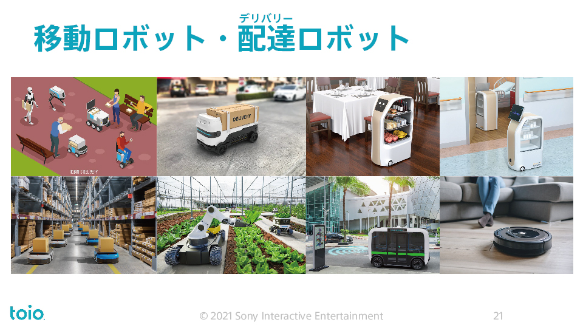

# 最初のプログラム（LED制御）

## toioとは？

toioはSONYが開発した小さなロボットキューブである．プログラムでモーターやライト，音などを制御できる．

*画像出典: https://toio.io/*


---

## toioの位置認識技術

- toioキューブの底面には特殊なセンサーがあり，マット上のドットパターンを読み取る
- これにより，正確な位置と角度を把握できる
- 位置認識技術は様々な移動ロボットにとって重要な技術である

*画像出典: https://lot.or.jp/project/7271/*





---

## 電源の入れ方・切り方

*画像出典: https://toio.github.io/toio-spec/docs/how_to_use_cube/*


キューブの底面に電源ボタンがある．電源ボタンを押すとキューブの電源が入る． また，電源ボタンを長押しすると電源を切ることができる．

---

## はじめてのtoioプログラム

```python
from toio.simple import SimpleCube
target_cube_name = "toio-xxx" #実際のキューブ名に変更
with SimpleCube(name=target_cube_name) as cube:  # toioに接続する
    # LEDライトを青色に点灯する（R=0, G=0, B=255）
    cube.turn_on_cube_lamp(0, 0, 255, 2)  # 2秒間青色に光る
    print("青色に光らせました")
```

このプログラムの動作：

1. キューブに接続
2. LEDを青色に2秒間点灯
3. 接続を自動的に切断

---

## toioプログラミングの基本構造

すべてのtoioプログラムは，次の3つの重要な行から始まる：

```python
from toio.simple import SimpleCube  # toioライブラリをインポート
target_cube_name = "toio-xxx" #接続先のキューブを指定
with SimpleCube(name=target_cube_name) as cube: # キューブに接続
    # ここにtoioを動かすコードを書く
    cube.turn_on_cube_lamp(0, 0, 255, 1)  # 例：青色LEDを点灯
```

### 重要ポイント

- `from toio.simple import SimpleCube`: toioライブラリを使えるようにする
- `target_cube_name = "toio-xxx"`: `xxx`の部分を手元のキューブに書かれた文字列に修正する．
- `with SimpleCube(name=target_cube_name) as cube:`: キューブに安全に接続する．この方法を使うと，プログラムが終わった時やエラーが起きた時に自動的に切断される
- **すべてのtoio操作コードは，この `with` ブロックの中に書く**

---

## キューブ名の確認と指定方法

### キューブ名を確認する

toioキューブの背面には，そのキューブ固有の名前のシールが貼られている．

例: `toio-A1B` や `toio-C2D` など

この名前をプログラムで指定することで，複数のキューブがある環境でも特定のキューブに接続できる．

### キューブ名を指定して接続する

```python
from toio.simple import SimpleCube
target_cube_name = "toio-A1B"  # 実際のキューブ名に変更

with SimpleCube(name=target_cube_name) as cube:
    # キューブを操作
    cube.turn_on_cube_lamp(0, 255, 0, 1)  # 緑色に光る
    cube.move(30, 1)  # 前進
```

**ポイント**:

- `target_cube_name` にキューブ背面に書かれた名前を正確に入力する
- 複数のキューブがあっても，指定した名前のキューブにのみ接続される
- 名前を指定しない場合（`SimpleCube()`）は，最初に見つかったキューブに接続される

---

## LED制御のAPI

### LEDを点灯する

```python
cube.turn_on_cube_lamp(r, g, b, duration)
```

パラメータ：

- `r`: 赤色の強さ（0〜255）
- `g`: 緑色の強さ（0〜255）
- `b`: 青色の強さ（0〜255）
- `duration`: 点灯時間（秒）．0を入力した場合は消灯命令を受けるまで点灯し続ける．

色の例：

- 赤: (255, 0, 0)
- 緑: (0, 255, 0)
- 青: (0, 0, 255)
- 黄: (255, 255, 0)
- 紫: (255, 0, 255)
- 水色: (0, 255, 255)

### duration=0の使い方

`duration=0`にすると，LEDは消灯命令を受けるまで点灯し続ける．これにより，点灯したままで他の処理（モーター制御や音再生など）を実行できる．

**duration=0を使わない場合**：

```python
cube.turn_on_cube_lamp(255, 0, 0, 2)  # 2秒間赤色（この間は他の処理ができない）
# 2秒後に自動消灯
```

**duration=0を使う場合**：

```python
cube.turn_on_cube_lamp(255, 0, 0, 0)  # 赤色点灯（すぐ次の処理へ）
cube.move(50, 2)  # 点灯したまま前進
cube.turn_off_cube_lamp()  # 明示的に消灯
```

**重要**: `duration=0`を使った場合，プログラムが終了すると自動的にLEDも消灯する．明示的に消灯したい場合は`cube.turn_off_cube_lamp()`を使う．

### LEDを消灯する

```python
cube.turn_off_cube_lamp()
```

### やってみよう 

**課題1（易）**: 赤色（255, 0, 0）でLEDを2秒間点灯させよ．

**課題2（中）**: 黄色（255, 255, 0）を1秒，紫色（255, 0, 255）を1秒，順番に点灯させよ．

**課題3（難）**: 自分の好きな色を3つ選んで，順番に点灯させるプログラムを書け．

<details markdown="1">
<summary>ヒント（課題3）</summary>

- RGB値を調整して好きな色を作る
- `cube.turn_on_cube_lamp(r, g, b, duration)` を3回使う

</details>

---

## プログラム例

<details markdown="1">
<summary>色の変化プログラム例を見る</summary>

```python
from toio.simple import SimpleCube
target_cube_name = "toio-xxx" #実際のキューブ名変更
with SimpleCube(name=target_cube_name) as cube:
    # 赤色
    cube.turn_on_cube_lamp(255, 0, 0, 1)

    # 緑色
    cube.turn_on_cube_lamp(0, 255, 0, 1)

    # 青色
    cube.turn_on_cube_lamp(0, 0, 255, 1)

```

</details>

**ポイント**: 色の組み合わせ（R, G, B）を変えることで，様々な色を作り出せる．
