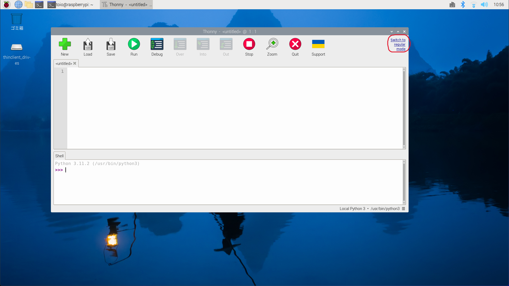
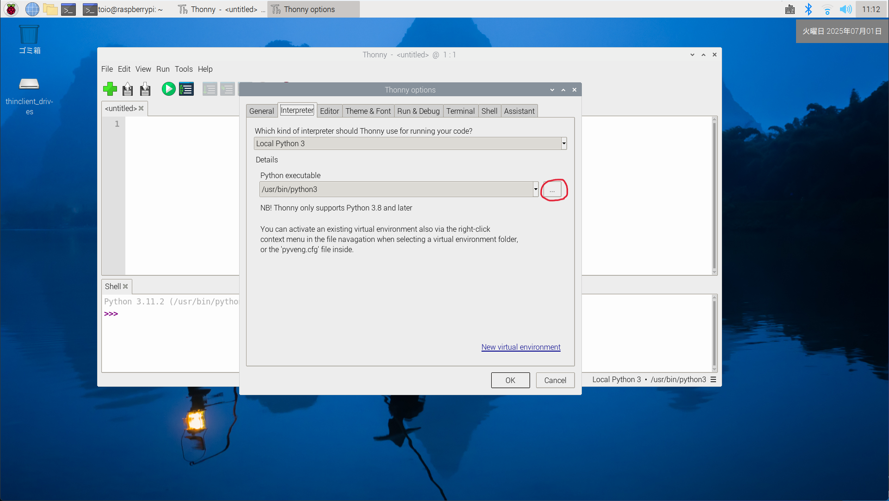
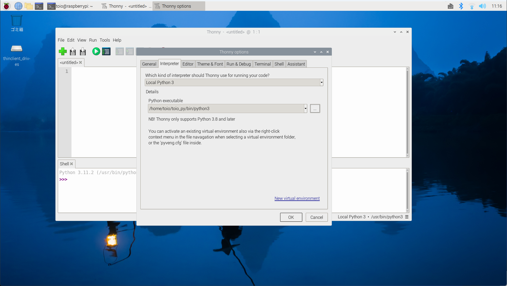

## toio.pyのセットアップ

### Pythonのバージョン確認

LXTerminalを開いて，Pythonのバージョンを確認する．

```shell
python --version
```

**必要なバージョン**: Python 3.8以上（推奨: 3.12）

- Python 3.8〜3.13の場合 → そのまま使用可能
- Python 3.8未満，3.14以上の場合 → Python 3.12のインストールが必要

---

### Python 3.12のインストール（必要な場合のみ）

Pythonのバージョンが古い場合，またはbleak==0.22.3のインストールでエラーが出る場合は，Python 3.12をインストールする．

**方法: pyenvを使う**

pyenvは複数のPythonバージョンを管理できるツール．

```shell
# ビルドに必要な依存パッケージをインストール（重要！）
sudo apt update
sudo apt install -y \
  build-essential \
  libssl-dev \
  zlib1g-dev \
  libbz2-dev \
  libreadline-dev \
  libsqlite3-dev \
  libncurses-dev \
  libffi-dev \
  liblzma-dev \
  tk-dev \
  uuid-dev \
  xz-utils

# pyenvのインストール
curl https://pyenv.run | bash

# シェル設定に追加（.bashrcまたは.zshrc）
echo 'export PYENV_ROOT="$HOME/.pyenv"' >> ~/.bashrc
echo 'export PATH="$PYENV_ROOT/bin:$PATH"' >> ~/.bashrc
echo 'eval "$(pyenv init -)"' >> ~/.bashrc

# 設定を反映
source ~/.bashrc

# Python 3.12のインストール（ビルドに10-20分かかる）
pyenv install 3.12.7

# グローバルで使用するバージョンを設定
pyenv global 3.12.7

# 確認
python --version
```

**ビルドに失敗した場合の対処**

もしPython 3.12のインストール中に `_ssl`, `_bz2`, `_curses` などのモジュールがコンパイルできないエラーが出た場合：

```shell
# 失敗したバージョンを削除
pyenv uninstall 3.12.7

# 依存パッケージが正しくインストールされているか確認
sudo apt install -y \
  build-essential \
  libssl-dev \
  zlib1g-dev \
  libbz2-dev \
  libreadline-dev \
  libsqlite3-dev \
  libncurses-dev \
  libffi-dev \
  liblzma-dev \
  tk-dev \
  uuid-dev \
  xz-utils

# 再度インストール
pyenv install 3.12.7
```

---

### 仮想環境を作成する

```shell
python -m venv ~/toio_py
```

仮想環境を有効化する

```shell
source ~/toio_py/bin/activate
```

すると，プロンプトの先頭に `(toio_py)` のように表示される．これは仮想環境が有効になっていることを示す．

仮想環境が有効な状態で次のコマンドを実行する：

```shell
python -m pip install setuptools --upgrade
python -m pip install typing-extensions
python -m pip install bleak==0.22.3
python -m pip install toio-py --upgrade
python -m pip install ipykernel
python -m pip install pynput
```

※ 2025年7月1日時点のbleakの最新バージョン（1.0.1）では，SimpleCubeの切断がうまくいかない．バージョン0.22.3を使用する．

※ `pynput`はキーボード操作でtoioを制御する際に使用する．リアルタイムなキー入力検出が可能で，sudo権限不要，他のアプリケーションへの影響もない．

確認

```shell
python -c "import toio.scanner; print('ok')"
```

`ok` と表示が出れば toio.py のインストールは成功である．

## Thonnyの設定

起動

1. 左上の Raspberry メニュー（ラズベリーマーク） をクリック

2. Programming（プログラミング） を選択

3. Thonnyをクリック

Thonnyが立ち上がる，regular modeになっていない場合は右上の'Switch to regular mode'をクリックする．

OKをクリックして，一度Thonnyを終了して，もう一度起動する．



簡易モードに戻す方法は

Tools -> Options -> General -> UI mode -> simple

インタープリタの設定

- メニューバーから  
  `Tools（ツール）` → `Options（オプション）`

- 上部タブで `Interpreter（インタープリタ）` を選択

- Python executableの...をクリック
  
  - 

- 環境を構築したフォルダを選択する

- ホーム -> toio_py -> bin -> python3

- OKをクリック
  
  - 

Thonny のShell画面に

```python
import toio.scanner; print('ok')
```

と入力し`ok`と表示が出れば設定完了．

---

## 日本語入力の有効化

### Raspberry Pi に日本語入力を導入する

**パッケージをインストール（Fcitx5 + Mozc + フォント）**

```shell
sudo apt update
sudo apt install -y fcitx5-mozc fonts-noto-cjk
```

- `fcitx5-mozc`：日本語入力システム（MozcはGoogle日本語入力のOSS版，fcitx5は最新版）
- `fonts-noto-cjk`：日本語フォント（Noto Sans CJK，Googleが開発した高品質フォント）

**入力メソッドをFcitx5に設定**

```shell
im-config -n fcitx5
```

このコマンドでFcitx5を標準の入力メソッドとして設定する．

**再起動する**

```shell
sudo reboot
```

**動作確認**

再起動後，タスクバー右上に Fcitx のアイコン（キーボードのようなマーク）が表示されているか確認する．

**入力切り替えキー**

- **Ctrl + Space** で日本語入力と英語入力を切り替える
- キーボードに **半角/全角キー** がある場合はそれでも切り替え可能

---

**システムフォントの変更**

システム全体のフォントをNoto Sans CJKに変更したい場合：

1. Raspberry Pi アイコン → Preferences（設定） → Appearance settings（外観の設定）
2. System（システム）タブ → Font（フォント）
3. `Noto Sans CJK JP Regular` を選択

---

### Chromium で日本語入力できない場合の対処

Raspberry Pi OS Bookworm では デフォルトで Wayland が有効になっており，
Wayland 環境では Chromium と Fcitx5 の組み合わせで 日本語入力が正常に動作しない場合がある．
この場合 X11 に切り替えることで解決する．

現在のセッション方式を確認

```shell
echo $XDG_SESSION_TYPE
```

wayland と表示された場合は 以下の手順で X11 に切り替える．

**Wayland を無効化して X11 に切り替える**

```shell
sudo raspi-config
```

Advanced Options を選択

Wayland を選択

表示された一覧で W1 X11 を選択

Finish を選択して raspi-config を終了

再起動を求められたら Yes を選択

再起動後の確認

```shell
echo $XDG_SESSION_TYPE
```

x11 と表示されれば 切り替え成功．

Chromium での日本語入力確認

Chromium を起動

入力欄をクリック

Ctrl + Space を押す

Fcitx5 Mozc が有効になり 日本語入力できることを確認

※Fcitxの入力メソッドでキーボード-英語が有効になる場合がある．その場合はキーボード-日本語を追加し，キーボード英語は入力メソッドから消す
