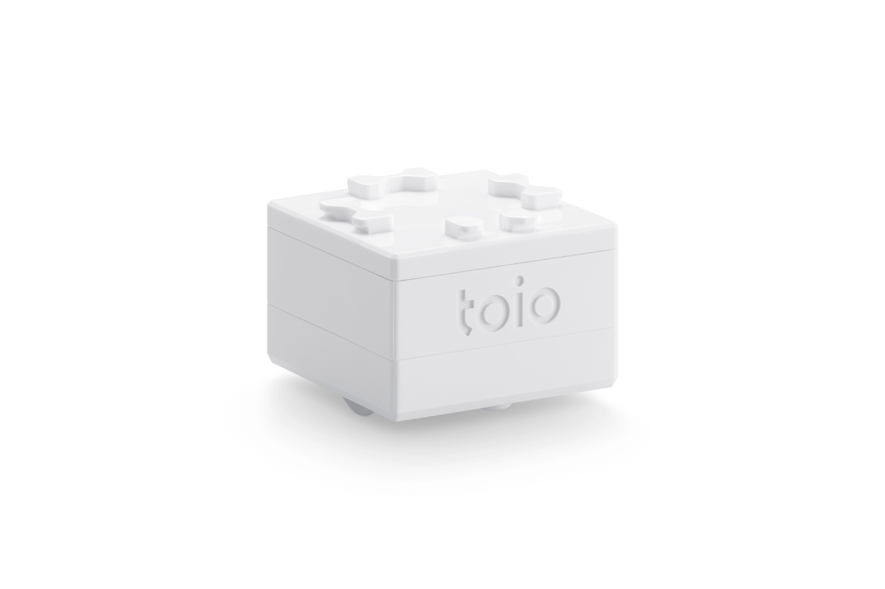

# toioロボットプログラミング実験

toioロボットとPythonで楽しくプログラミングを学ぼう．

*画像出典: https://toio.io/*

## 授業について

**授業時間**: 合計6時間（3時間 × 2回）

**目的**: SONYのtoioキューブを用いたロボットプログラミングを通じて，プログラムで物理的な物体を制御する楽しさを体験する．

## 学習内容

### [1日目](day1/)

環境構築からtoioの基本機能まで学ぶ：

1. [環境設定](day1/setup.html) - Raspberry Pi，Python仮想環境，toio.pyのセットアップ
2. [最初のプログラム](day1/first-program.html) - toioとの接続，LED制御
3. [モーター制御](day1/motor.html) - 前進，後退，回転
4. [音とサウンド制御](day1/sound.html) - 音・メロディの再生
5. [センサー入力](day1/sensors.html) - ボタン，姿勢，傾き検出

### [2日目](day2/)

複合制御とコンテスト課題に挑戦：

1. [複合制御とキーボード操作](day2/advanced-control.html) - 位置情報+センサー+条件分岐，キーボード操作
2. [コンテスト課題](day2/challenge-guide.html) - 宝探しゲーム

### [リファレンス](reference/)

必要に応じて参照：

- [Pythonリファレンス](reference/python-reference.html) - 変数，演算子，if/for/while，リストなど

## 学習の進め方

1. **実験を通じて学ぶ**: APIの使い方を学んだら，自分で試行錯誤しながらプログラムを作成
2. **少しずつ動作確認**: 最初は速度を低めに設定し，動作を確認しながら進める
3. **エラーを恐れない**: エラーが出たら，メッセージをよく読んで原因を探る

## 参考リンク

- [toio.py 公式GitHubリポジトリ](https://github.com/toio/toio.py)
- [toio公式サイト](https://toio.io/)
- [toio技術仕様](https://toio.github.io/toio-spec/)

---

**それでは，toioロボットプログラミングを楽しもう．**
